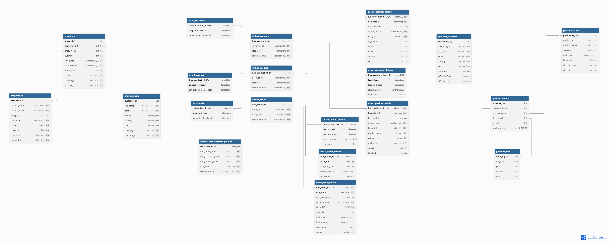
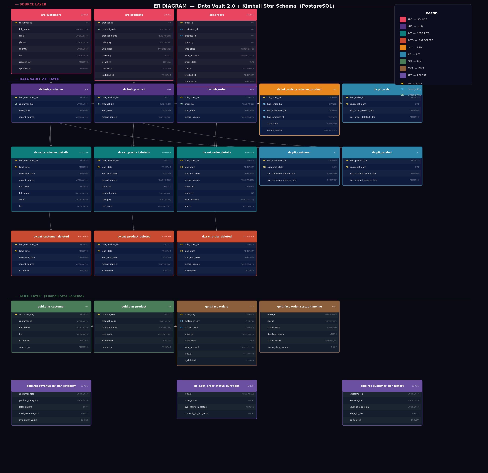

# Data Vault 2.0 + Kimball Star Schema — PostgreSQL Reference Implementation

> A production-oriented, fully runnable hybrid data warehouse combining **Data Vault 2.0**
> for raw-vault ingestion and **Kimball Dimensional Modeling** for the Gold consumption layer —
> built entirely on **PostgreSQL**.

---

## Architecture Overview

```
src  (Source / Staging)
  └── src.customers / src.products / src.orders
        │
        ▼  CALL dv.load_vault();
dv   (Raw Vault — Data Vault 2.0)
  ├── Hubs        hub_customer  hub_product  hub_order
  ├── Satellites  sat_*_details  +  sat_*_deleted  (soft-delete pattern)
  ├── Links       lnk_order_customer_product
  └── PITs        pit_customer  pit_product  pit_order
        │
        ▼  CALL gold.refresh_gold();
gold (Information Mart — Kimball Star Schema)
  ├── Dimensions  dim_customer  dim_product
  ├── Facts       fact_orders  fact_order_status_timeline
  └── Reports     rpt_revenue_by_tier_and_category
                  rpt_order_status_durations
                  rpt_customer_tier_history
```






---

## Key Engineering Decisions

| Decision | Rationale |
|---|---|
| MD5 hash keys | Deterministic, portable, computable in pure SQL |
| LATERAL in PIT rebuild | Forces per-row evaluation; enables index usage on `(hub_hk, load_date DESC)` |
| `load_date::DATE` avoided in LATERAL | Casting a column kills index sargability; pre-compute `upper_bound` instead |
| Separate `sat_*_deleted` satellites | Deletions are events, not mutations — pure DV2.0 pattern |
| `load_end_date` via UPDATE | Dan Linstedt explicitly permits this; it is a derived temporal column |
| Star schema on top of vault | Kimball consumption layer for BI tool compatibility |

---

## Project Structure

```
dvproject/
├── README.md
├── sql/
   ├── 01_ddl/
   │   ├── 01_schemas.sql
   │   ├── 02_source_tables.sql
   │   ├── 03_vault_tables.sql        hubs + satellites + links + PITs
   │   └── 04_alter_pit_columns.sql   add sat_*_deleted_ldts columns
   ├── 02_etl/
   │   ├── 01_load_hubs.sql
   │   ├── 02_load_satellites.sql     includes delete + resurrection detection
   │   ├── 03_close_versions.sql
   │   ├── 04_load_links.sql
   │   ├── 05_rebuild_pits.sql        LATERAL + index-safe upper_bound
   │   └── 06_load_vault.sql          master orchestration procedure
   ├── 03_gold/
   │   └── 01_refresh_gold.sql        all Gold views + refresh procedure
   └── 04_indexes/
       └── 01_indexes.sql

```


